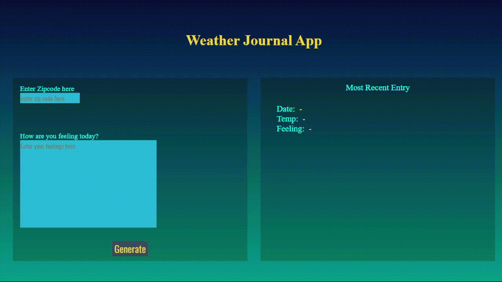

# Weather-Journal App Project


## Overview
This project is an asynchronous web app that uses *`OpenWeatherMap`* Web API and user data.
It simply takes a *`ZIP Code`* from the user & his *`feelings`* then it gets the current tempreture for the specifed ZIP to dynamically update the UI with the results from the API.


# Demo-Preview




# Table of contents

- [Project Title](#Weather-Journal-App-Project)
- [Demo-Preview](#demo-preview)
- [Table of contents](#table-of-contents)
- [Installation](#installation)
- [Usage](#usage)
- [Development](#development)
- [Footer](#footer)


# Installation

The first one should be how to install(how to generally use your project or set-up for editing in their machine).

This should give the users a concrete idea with instructions on how they can use your project repo with all the steps.

Following this steps, **they should be able to run this in their device.**

A method I use is after completing the README, I go through the instructions from scratch and check if it is working.

Here is a sample instruction:

To use this project, first clone the repo on your device using the command below:
```
git init

git clone https://github.com/JoeWagdy/weather-journal-app.git
```
open the terminal in the project location and start the server using the command below:
``` 
node server.js
```


# Usage
[(Back to top)](#table-of-contents)

open your [local host](http://localhost:5050/) enter your *Zip Code* & you're *feelings* press **`Generate`**

And here are The current temperature for your zip location the Date and Your feelings.

# Development
[(Back to top)](#table-of-contents)

You can specify the port for your server on the `server.Js` file.


# Footer
[(Back to top)](#table-of-contents)

This is the second project in `EG-FWD front-end web development nano degree` from **Udacity**

Leave a star in GitHub, give a clap in Medium and share this guide if you found this helpful.

